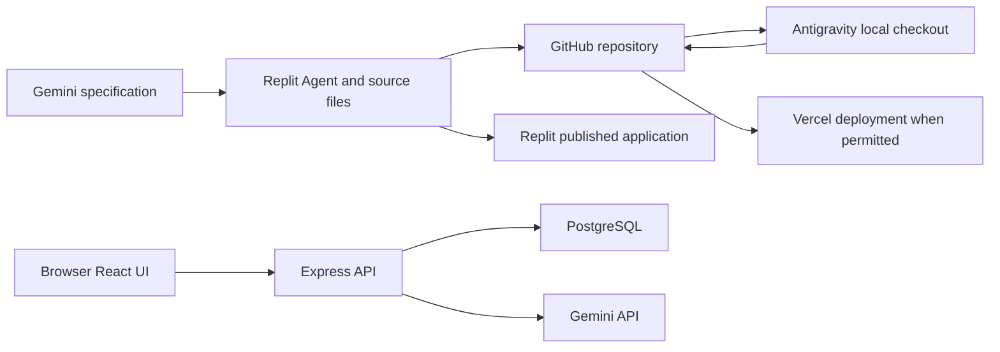

# NIAT hackathon mentor preparation and practical workbook

Prepared on 5 October 2026 for practice before the event on 6 October 2026, India time.

Your goal tonight is to complete one real application workflow and learn to locate failures quickly. No preparation can cover every possible bug. This workbook covers the main failure boundaries in the supplied stack, including code generation, API requests, authentication, persistence, version control, and deployment.

This is a learning plan and reference guide. Cloud accounts, API calls, databases, and deployments have not been exercised on your behalf. Commands are exercises for a disposable practice project, not instructions to run blindly in a participant's existing repository. Replace example URLs and names with the actual project values.

## 1 What the attachment establishes

Source: `C:\Users\Darshit N\Downloads\Full-Stack Application.docx`, read in full including its external hyperlinks.

The document describes seven stages:

1. Create a Replit account, using GitHub authentication.
2. Use Gemini or another LLM to turn the problem statement into a comprehensive build specification.
3. Build using Replit Agent and use Replit's PostgreSQL database instead of Supabase.
4. Connect the repository to GitHub and push the code.
5. Configure `GEMINI_API_KEY` and `JWT_SECRET` in Replit Secrets.
6. Test registration, login, farms, fields, crops, AI advice, and persistence; fix problems and push updates.
7. Publish on Replit and test the public application.

Its example application is an AI agriculture crop advisory assistant. Its named technology requirements are React, Node and Express, Replit Postgres, `@google/genai`, Zod, and Tailwind CSS. Cursor, Claude Code, Replit Agent, and Bolt appear as example coding-agent destinations; this is not evidence that all are required. Claude also appears as a possible specification writer.

Antigravity and Vercel are additional workflows you requested. Supabase is mentioned in the attachment as the database to avoid in its main path. Practise the supplied Replit path first. Establish organizer rules before recommending an alternative during the event.

### Corrections to apply while learning

- Generate a random JWT signing secret. A name plus project title is predictable.
- A successful Agent response is not proof that a feature passed. Check browser behavior, HTTP responses, and database rows.
- Git transfers committed files. It does not transfer Secrets, database rows, OAuth configuration, hosting configuration, or account permissions.
- Workspace preview and a published app are different environments.
- An ambitious prompt does not make an application production ready. Split implementation into verifiable milestones.
- `auth.uid()` belongs to Supabase's auth integration; do not copy those policies unchanged into ordinary Replit Postgres with custom JWT auth.

## 2 Model and tool selection

For this broad preparation and difficult cross-platform incidents, GPT-6 Astra with High reasoning is appropriate if available. Its official model page positions it for demanding reasoning and coding work. [OpenAI model guidance](https://developers.openai.com/api/docs/models/gpt-6-astra).

Use GPT-5.6 Sol Medium for routine teaching and single-bug analysis; use High when multiple plausible causes need careful investigation. Instant is adequate for short commands or explanations. GPT-5.6 Terra is an alternative for sustained reasoning when efficiency matters; Luna is appropriate for short, isolated tasks. These are task-routing suggestions, not a measured comparison on this hackathon.

Use Gemini 3.8 Flash in your Antigravity IDE for local implementation, terminal inspection, and small fixes because it can work directly in that environment. Verify which model is offered in your account; access and credits vary. Use Replit Agent for the event's prescribed build and publish workflow. The model in your editor and the model called by the app's Gemini API are separate choices with separate access and usage.

Do not switch models repeatedly for a wrong URL or missing secret. Gather evidence first. Reserve a stronger model for ambiguity that remains after inspection.

## 3 Understand the connections



Read this as two flows. The top flow moves source code. The runtime flow moves requests: browser to backend, then backend to database or Gemini. GitHub is not the database or backend.

| Component | Responsibility | First evidence to inspect |
|---|---|---|
| React | Render UI, collect input, send HTTP requests | Console and Network tabs |
| Vite | Development server and frontend build | Terminal and build output |
| Express | Routes, validation, auth, database and Gemini calls | Server logs and HTTP response |
| PostgreSQL | Store users and records | Correct database, schema, rows, query errors |
| Zod | Check input and returned data shapes | Validation issue path and expected type |
| Tailwind | Compile styling utilities | Installed version, CSS imports, Vite plugin |
| Gemini API | Generate advice | Provider status, model ID, response shape |
| GitHub | Store committed source and collaboration history | Branch, commit, remote, permissions |
| Replit or Vercel | Build and run deployed application | Build logs, runtime logs, deployment configuration |
| Antigravity | Edit and run a local checkout | Actual files, terminal, local environment |

Learn these terms: endpoint is an HTTP address and method; origin is scheme plus host plus port; migration changes database structure; environment variable configures a process or build; CORS controls browser access to cross-origin responses; JWT is a signed token whose claims still require server verification.

## 4 Tonight's practice schedule

| Block | Time | Passing result |
|---|---:|---|
| Accounts and tool checks | 20 minutes | Can access Replit, GitHub and AI Studio |
| Small Replit application | 70 minutes | Signup, login, create and reload a farm |
| Gemini integration | 35 minutes | Real server-side response and understandable failure |
| GitHub and Antigravity round trip | 35 minutes | Same tested fix reaches both checkouts |
| Replit publish | 35 minutes | Fresh account works on public URL |
| Deliberate bug drills | 60 minutes | Diagnose at least six failures from evidence |
| Optional Supabase and Vercel lab | 60 minutes | Can explain or demonstrate the alternate path |
| Rehearse mentoring and record evidence | 15 minutes | Can explain your diagnosis in two minutes |

This is an approximate five-and-a-half-hour plan. Account access, generation, and debugging may take longer. If you have only three hours, complete the main Replit path, Git sync, and four drills; skim the alternatives. Stop adding features once the core flow works.

## 5 Prepare accounts and the practice environment

1. Sign into GitHub and create or select a practice-only repository.
2. Sign into Replit using the document's GitHub path if offered. Check verification and onboarding.
3. Sign into [Google AI Studio](https://aistudio.google.com/). Select the correct Google project and create an API key if needed. Check actual model access and quota.
4. Open Antigravity IDE. Open a new local folder for the later clone. Its official getting-started guide describes local folders, terminal access, and the agent panel. [Antigravity IDE setup](https://codelabs.developers.google.com/getting-started-agy-ide).
5. For the optional lab, sign into Supabase and Vercel. Confirm that Vercel's GitHub integration can see the intended repository.
6. Check the terminal:

```powershell
node --version
npm.cmd --version
git --version
```

Use the Node version required by the generated project and its SDK, preferably a supported LTS version satisfying both. Reopen your terminal after installation. `npm.cmd` avoids invoking PowerShell's npm script shim if local execution policy blocks it.

7. Write down the workspace URL, public URL, GitHub repository, active branch, and project directories. Do not record passwords or API key values in this log.
8. Check account entitlements early. Do not assume a plan includes unlimited Agent use, API quota, or free publishing. Replit publishing may ask for a payment method. [Replit publishing](https://docs.replit.com/learn/projects-and-artifacts/replit-deployments).

Passing check: logins work, terminal tools respond, and you know which account owns each resource.

## 6 Lab A Build the document's application in Replit

### A1 Use a small specification

For practice, build registration, login, farms, fields, crop records, one advisory form, and saved history. Leave weather feeds, maps, sensors, payments, and advanced analytics for later.

Paste this into Gemini or another specification writer:

```text
Prepare an implementation specification for a NIAT hackathon practice app,
an AI agriculture crop advisory assistant. Follow these sections:
persona, mission, goal, features, technologies, pages, user flow,
domain categories, advisory inputs, SQL schema, data isolation,
API routes, Gemini setup, AI instructions, output schemas, Zod validation,
components, security, environment example, folders, phases,
acceptance criteria, final coding-agent instructions.

Required stack: React, Node/Express, Replit PostgreSQL, @google/genai,
Zod and Tailwind. Use Replit's database, not Supabase.
Scope: register/login/logout, farm and field creation, crop records,
text advisory, saved history. Include user ownership of all records.
Gemini runs only on the server. JWT secret must be randomly generated.
Use a currently supported API model available to the account, configured
through GEMINI_MODEL. Do not guess credentials or account entitlements.
Define exact request and response examples. Prefer one origin for UI/API.
Split implementation into independently verifiable phases.
Do not claim production readiness or completed tests without evidence.
```

Read the result before using it. Check for invented dependencies, inaccessible models, incompatible auth choices, destructive migration commands, and unnecessary features. The long reference structure is a specification format; it need not be executed in one Agent turn.

### A2 Implement and prove one phase at a time

Paste the specification into Replit Agent with this instruction:

```text
Use Replit's PostgreSQL database. Implement phase 1 only: React UI,
Express server, GET /api/health, schema and register/login/logout.
Inspect existing files before editing. Preserve existing work and secrets.
Use the installed dependency versions consistently. Show run/build commands,
environment variable names and a manual verification checklist.
Do not log credentials or use mock success for real authentication.
Stop after phase 1 and report files changed, checks run and remaining gaps.
```

1. Open Preview and server Console.
2. Visit `/api/health`. Expect JSON such as `{"ok":true}`. This proves the server answers, not that database or Gemini works.
3. Create a test account, log out, and log in again.
4. Try a wrong password. Expect a controlled rejection, not a crash.
5. Reload after login; verify the intended session behavior.
6. Inspect the user row in the development database. Password storage must be hashed, not plain text.
7. Proceed to farms, fields and crops only after auth works.
8. Create a farm, a field linked to it, and a crop linked to the field. Reload and restart the app, then verify persistence.
9. Use a second account. It must not see or mutate the first account's records.

Replit provides a built-in SQL database and a Database tool for tables, queries and connection settings. [Database setup](https://docs.replit.com/features/data-and-storage/sql-database).

### A3 Understand the API contract

For your practice app, agree on these routes with the Agent. They are proposed exercises, not routes guaranteed by the attachment:

| Method and route | Request | Expected response |
|---|---|---|
| `GET /api/health` | None | 200 with `{ok:true}` |
| `POST /api/auth/register` | Email and password | Account created or validation/conflict error |
| `POST /api/auth/login` | Email and password | Valid session or 401 |
| `POST /api/farms` | Name and location | Created farm with ID |
| `POST /api/fields` | Owned farm ID and field details | Created field |
| `POST /api/crops` | Owned field ID and crop details | Created crop |
| `POST /api/advisories` | Crop, symptoms, optional owned record ID | Validated advisory and saved ID |
| `GET /api/advisories` | Authenticated session | Only this user's history |

Each protected route gets the user ID from a verified session. A client-supplied `userId` is not proof of ownership. Check ownership of referenced farms and fields before writing child records.

### A4 Confirm frontend to backend communication

Prefer relative URLs when both are served on one origin:

```js
const response = await fetch('/api/health');
if (!response.ok) throw new Error(`HTTP ${response.status}`);
const result = await response.json();
```

For separate local Vite and Express servers, a development proxy can make `/api` reach Express. Example only; preserve the project's existing plugins:

```js
server: {
  proxy: {
    '/api': 'http://localhost:3001'
  }
}
```

The Vite development proxy does not automatically become a production proxy. You must deploy API routing separately. [Vite server options](https://vite.dev/config/server-options).

Use the browser Network tab. Inspect the actual method, URL, request payload, status, content type, and response body. Do not treat a green 200 response as proof of valid data: it may contain your HTML page. [Chrome Network inspection](https://developer.chrome.com/docs/devtools/network/).

Passing check: a browser request reaches the intended route and returns the agreed JSON shape.

## 7 Lab B Configure secrets and connect Gemini

### B1 Put each variable in the correct environment

| Name | Where it belongs | Purpose |
|---|---|---|
| `GEMINI_API_KEY` | Backend secret | Google API authentication |
| `GEMINI_MODEL` | Backend configuration | Supported model ID |
| `JWT_SECRET` | Backend secret, custom JWT auth only | Sign and verify app JWTs |
| `DATABASE_URL` | Backend environment | Database connection |
| `PORT` | Backend runtime configuration | Listening port where applicable |
| `VITE_API_BASE_URL` | Frontend build, split hosting only | Public API origin |
| `VITE_SUPABASE_URL` | Optional frontend build | Public Supabase endpoint |
| `VITE_SUPABASE_PUBLISHABLE_KEY` | Optional frontend build | Publishable API key |

Never put Gemini credentials, JWT secrets, DB passwords or elevated Supabase keys into `VITE_*`. Vite exposes those values in the browser bundle; frontend changes generally require rebuilding. [Vite environment variables](https://vite.dev/guide/env-and-mode).

1. In Replit, find Tools, then Secrets. Add `GEMINI_API_KEY` and `JWT_SECRET`; use the configuration area for non-secret settings if available.
2. Read the variable names used in the source; capitalization must match.
3. Restart the app if necessary. Confirm published runtime settings separately before deployment.
4. For local Node, create an ignored `.env`; load it using the project's existing dotenv setup or Node's supported `--env-file` feature. Node does not load every `.env` automatically. [Node environment loading](https://nodejs.org/learn/command-line/how-to-read-environment-variables-from-nodejs).
5. Commit a `.env.example` with empty values and explanatory comments.

Replit Secrets exposes configured values as environment variables; this does not make copying values to a frontend safe. [Replit Secrets](https://docs.replit.com/core-concepts/project-editor/app-setup/secrets).

Generate a random secret on your own machine in a private terminal:

```powershell
node -e "console.log(require('node:crypto').randomBytes(32).toString('hex'))"
```

This deliberately displays the newly generated value so you can store it. Do not run it while screen sharing. Do not rotate an existing shared secret casually: old sessions may stop working.

Check only presence, not values, from a server process that has loaded its environment:

```js
console.log({
  geminiConfigured: Boolean(process.env.GEMINI_API_KEY),
  databaseConfigured: Boolean(process.env.DATABASE_URL),
  authConfigured: Boolean(process.env.JWT_SECRET)
});
```

### B2 Test the provider before involving the entire application

1. Ask for a small backend-only smoke script in the practice repository.
2. Install the project's selected `@google/genai` version using its package manager if needed.
3. Use `GEMINI_MODEL` with a supported model ID from the actual account. Google's currently fetched quickstart uses `gemini-3.8-flash`; account access still needs verification.
4. Send one short, non-sensitive request.
5. Print only the generated test text and sanitized failure information.

Illustrative ESM script, using the current Interactions quickstart:

```js
import { GoogleGenAI } from '@google/genai';

if (!process.env.GEMINI_API_KEY || !process.env.GEMINI_MODEL) {
  throw new Error('Configure GEMINI_API_KEY and GEMINI_MODEL');
}
const ai = new GoogleGenAI({apiKey: process.env.GEMINI_API_KEY});
try {
  const result = await ai.interactions.create({
    model: process.env.GEMINI_MODEL,
    input: 'Reply with one short sentence about checking soil moisture.'
  });
  if (!result.output_text?.trim()) {
    console.error('Provider returned no usable text');
    process.exitCode = 1;
  } else {
    console.log(result.output_text);
  }
} catch (error) {
  const status = error?.status;
  console.error('Provider request failed', {
    status: Number.isInteger(status) ? status : 'unknown'
  });
  process.exitCode = 1;
}
```

Save as `scripts/gemini-smoke.mjs` in your practice app. With a supported Node version and local `.env`, run `node --env-file=.env scripts/gemini-smoke.mjs`. In Replit with injected Secrets, run `node scripts/gemini-smoke.mjs`.

Check the installed SDK supports the methods shown. An existing application may use `ai.models.generateContent` with `contents` and `response.text`. Keep that internally consistent rather than combining it with Interactions' `input` and `output_text`. A working existing integration need not be migrated during the event. [Google SDK quickstart](https://ai.google.dev/gemini-api/docs/get-started), [supported models](https://ai.google.dev/gemini-api/docs/models).

### B3 Integrate validation and persistence

Have the server execute this sequence:

1. Verify the user's session.
2. Validate input with Zod and check referenced record ownership.
3. Call Gemini with bounded input and a request deadline appropriate to the hosting runtime.
4. Request structured fields such as `summary`, `possibleCauses`, `actions` and `limitations`.
5. Parse and validate the returned data again.
6. Save a successful advisory under the authenticated user, then return its ID and content.
7. Return a controlled failure if the provider or save fails. Do not claim the record was saved when only generation succeeded.

Structured output helps enforce shape; it does not guarantee that advice is factually correct. [Gemini structured output](https://ai.google.dev/gemini-api/docs/structured-output). Zod's `safeParse` returns a success/failure result so validation can become a useful 400 response instead of an accidental server crash. [Zod basics](https://zod.dev/basics).

Advisory copy should state uncertainty and encourage appropriate local expertise for crop treatment decisions. Do not invent exact pesticide dosing from incomplete symptoms. Keep this practical: ask for crop, stage, symptoms, location, and relevant observations before making recommendations.

Passing check: one real advisory is generated, validated, saved, and visible after reload; an invalid input and simulated provider failure produce useful errors.

### B4 Authentication and ownership checks

For custom JWT auth, the server must verify the signature with the configured key, restrict accepted algorithms, and enforce expiration and any configured issuer/audience. Decoding a token is not verification. Hash passwords with a suitable password-hashing library; do not log them or compare stored plain text.

Use a normal browser for account A and incognito for account B. Create a farm as A. In the practice app, make B request A's farm ID directly, rather than testing only whether the UI hides it. Repeat for read, update, delete and child-record creation. Every operation must reject unauthorized ownership; unchanged rows are part of the evidence. An app may intentionally return 404 instead of 403 to avoid revealing that another user's record exists.

For Supabase Auth, send the user's actual access token to a custom backend and verify it through the supported auth/JWKS mechanism, such as an appropriate server-side `getUser` call. Do not assume a custom app JWT secret verifies Supabase tokens. Likewise, a Supabase publishable API key is not a user's access token.

Use parameterized database queries or the ORM's safe bindings. For cookie sessions, review CSRF protection as well as cookie flags; CORS alone does not protect state-changing requests.

Passing check: changing the record ID or a submitted user ID cannot gain access to another account's data.

## 8 Lab C GitHub and Antigravity round trip

### C1 Push from Replit

1. Open the Git pane through Tools. Connect the intended GitHub account and remote repository.
2. Confirm repository owner and branch. Interface labels may differ from the attachment.
3. Inspect changed files; ensure `.env`, credentials, personal exports and generated junk are excluded.
4. Stage intended files, commit with a descriptive message, then push.
5. Open GitHub and confirm the latest commit is visible on the same branch.

The Git pane supports repository connections, staging, commits, branches and push/pull. [Replit Git interface](https://docs.replit.com/features/workspace-tools/git-interface).

Recommended ignore rules, adapted to the practice project:

```gitignore
node_modules/
dist/
.env
.env.*
!.env.example
.vercel/
```

Ignoring a file does not untrack a file already committed. If a credential leaked, revoke or rotate it first; deleting the current file does not remove the credential from history. Follow an agreed cleanup process. [GitHub sensitive-data response](https://docs.github.com/en/authentication/keeping-your-account-and-data-secure/removing-sensitive-data-from-a-repository).

### C2 Clone into Antigravity

Run in a new local parent folder; replace the example URL:

```powershell
git clone https://github.com/YOUR_ACCOUNT/niat-crop-practice.git
cd niat-crop-practice
git status
git branch --show-current
git log -1 --oneline
npm.cmd run
```

`npm run` lists declared scripts. Read the README and `package.json` before assuming `dev`, `build` or `start` exists. Follow the repository's package manager and lockfile.

With a valid npm lockfile, run `npm.cmd ci`. Without one, use `npm.cmd install` and review the generated lockfile. `npm ci` rejects a mismatched lockfile and replaces `node_modules`; use it in the new practice clone, not blindly in an existing customized environment. [npm ci](https://docs.npmjs.com/cli/commands/npm-ci/).

Open the clone's folder in Antigravity, configure local environment values privately, and start the documented commands. Inspect platform-specific packages or auth dependencies if it fails locally.

### C3 Handle database portability correctly

Replit's current development `DATABASE_URL` is scoped to the Replit app; its docs say it cannot be used from another app or an external database viewer. Production connection strings can be used by compatible external clients. Older Neon development databases differ. [Replit connection details](https://docs.replit.com/features/data-and-storage/connection-details).

Therefore, if the clone cannot connect locally:

1. Determine the database infrastructure and connection type.
2. For practice, prefer a separate local PostgreSQL database with the same schema and synthetic records.
3. Run only reviewed migrations against that practice database.
4. Alternatively, test backend-dependent behavior in Replit while doing code review locally.
5. Do not connect to a participant's production database just to make a local test pass.
6. If using an externally reachable Replit production database for a disposable demo, explicitly configure it on the target host and recognize that it is shared live data.

### C4 Make one small fix and return it

In a clean practice checkout, replace `src/...` with the actual files:

```powershell
git switch -c practice/advisory-error-message
# Edit and test one small change.
git diff
git add src/ACTUAL_CHANGED_FILE
git diff --cached
git commit -m "Show a useful advisory failure message"
git push -u origin practice/advisory-error-message
```

Open a pull request or merge by your team's agreed workflow. Do not assume a branch push updates `main` or triggers the production branch deployment.

Back in Replit, preserve or commit intended local edits first. Pull the merged branch, confirm the commit, rerun the affected feature, then republish if needed.

One person or agent should edit the shared integration branch at a time. A GitHub push does not automatically update an already-open local or Replit checkout. Importing a GitHub repository is supported, but runtime services and environment configuration still need setup. [Replit imports](https://docs.replit.com/build/import-from-providers).

### C5 Recover from common Git failures

| Failure | First check | Recovery |
|---|---|---|
| Repository not found | URL, owner, account, private repo permission | Correct connection and grant access |
| Authentication failed or 403 | Credential identity and repository write permission | Use authorized OAuth/credential manager or properly scoped token; not GitHub account password |
| Remote already exists | Existing remote configuration | Reuse or correct it; do not keep adding remotes |
| Non-fast-forward rejection | Remote commits ahead of local | Fetch, inspect, integrate with merge/rebase under team policy, then push |
| Local changes would be overwritten | Uncommitted work | Preserve and commit intended work before integration |
| Conflict markers | `git status` and conflicted files | Resolve intended code, test, stage, complete integration |
| Branch has no upstream | Actual current branch | `git push -u origin ACTUAL_BRANCH` |
| Nothing to commit | Files saved, correct folder and ignore rules | Inspect actual status; do not create random changes |

For a clean practice checkout expecting only a fast-forward: `git pull --ff-only`. If it fails, inspect divergence instead of force-pushing. GitHub explains fetching and merging remote changes to resolve non-fast-forward failures. [GitHub push recovery](https://docs.github.com/en/get-started/using-git/dealing-with-non-fast-forward-errors).

Passing check: the tested fix is present in both checkouts at the intended commit. You can explain clone, commit, push, pull and deployment as separate actions.

## 9 Lab D Publish on Replit

1. Check the actual build and start commands in `package.json` and `.replit`.
2. Run the production build before publishing. A dev server starting successfully is not evidence that the production build works.
3. Make sure the production server uses the configured port and an appropriate network binding. Example for a normal Replit-hosted Express process:

```js
const port = Number(process.env.PORT || 3000);
app.listen(port, '0.0.0.0');
```

The internal port must match Replit's external port mapping. [Replit ports](https://docs.replit.com/features/project-setup/ports).

4. Use a deployment type that runs your backend. Static hosting alone cannot execute Express or keep server-side API secrets. [Replit deployment types](https://docs.replit.com/features/publishing/deployment-types).
5. Open Publish and inspect build, run, database, secret and account settings.
6. Inspect schema changes before publication. Do not blindly accept destructive table/column removal.
7. Publish, then inspect build logs and runtime logs separately.
8. Open the public URL in an incognito browser and on your phone.
9. Create a fresh public-site account, create a farm, generate advice and reload.
10. Open a nested URL directly, log out and back in, and test a second user.
11. After a fix, publish again and confirm the public app reflects the intended version.

Replit uses separate development and production databases. The public app may correctly start with no preview accounts or records. Verify the correct database before interpreting missing data as data loss. [Development and production databases](https://docs.replit.com/features/data-and-storage/development-and-production).

Publishing captures a snapshot and runs it separately from the editor; code edits require republishing. Keep durable records in a database or storage service rather than the published filesystem. [Publishing behavior](https://docs.replit.com/learn/projects-and-artifacts/replit-deployments).

Passing check: signup, login, creation, real AI and persistence work from the public URL without your editor session.

## 10 Lab E Optional Supabase connection

Use a separate practice project when this alternative is allowed. Do not add Supabase merely to fix a Replit database configuration bug.

### E1 Pick an architecture

Two distinct options:

- React uses Supabase Auth and the Supabase Data API; user data access is protected by grants and RLS. Gemini still runs through an authenticated server endpoint.
- Express uses a PostgreSQL connection or a privileged Supabase client; Express must authenticate users and enforce ownership. Privileged connections can bypass RLS.

Choose deliberately. Replacing a database URL does not migrate your users, tables, auth design or data.

### E2 Connect a React client

1. Create the practice project and wait until it is ready.
2. Obtain the project URL and publishable key from Connect or API Keys.
3. Install `@supabase/supabase-js` with the project's package manager.
4. Put the URL and publishable key in your frontend environment:

```dotenv
VITE_SUPABASE_URL=https://YOUR_PROJECT.supabase.co
VITE_SUPABASE_PUBLISHABLE_KEY=YOUR_PUBLISHABLE_KEY
```

5. Initialize one client:

```js
import {createClient} from '@supabase/supabase-js';
export const supabase = createClient(
  import.meta.env.VITE_SUPABASE_URL,
  import.meta.env.VITE_SUPABASE_PUBLISHABLE_KEY
);
```

A publishable key is intended for public clients. Secret keys and legacy `service_role` keys are server-only and bypass RLS. The publishable key identifies the app; the user's session identifies the person. [Supabase API keys](https://supabase.com/docs/guides/getting-started/api-keys).

### E3 Create one protected table

Run once in a new disposable Supabase project. This is a narrow select/insert exercise, not a complete app schema:

```sql
create table public.mentor_notes (
  id uuid primary key default gen_random_uuid(),
  user_id uuid not null references auth.users(id),
  body text not null,
  created_at timestamptz not null default now()
);

alter table public.mentor_notes enable row level security;
revoke all on public.mentor_notes from anon;
grant select, insert on public.mentor_notes to authenticated;

create policy notes_read_own on public.mentor_notes
for select to authenticated
using ((select auth.uid()) = user_id);

create policy notes_insert_own on public.mentor_notes
for insert to authenticated
with check ((select auth.uid()) = user_id);
```

1. Register a test user and complete email confirmation if required.
2. Sign in and obtain the authenticated user ID.
3. Insert a note with that ID and read it back.
4. Sign in as another user; the first user's note must be absent.
5. Try inserting with the first user's ID; it must fail.
6. Always inspect both `data` and `error` from the SDK.

RLS select filtering can return zero rows without an error; missing grants or insert checks may produce permission failures. The SQL editor often runs with elevated access, so a successful SQL-editor query does not prove browser authorization works. [Supabase RLS](https://supabase.com/docs/guides/database/postgres/row-level-security).

### E4 Configure authentication redirects

Set Auth URL Configuration's Site URL to the public application URL. Add exact allowed callback URLs for localhost and the required deployments. In an OAuth provider, also configure the Supabase callback URI supplied by Supabase; this is a different setting from the final app redirect.

Test signup confirmation, OAuth if used, and password reset from the actual public site. Signup may create a user without an active session while email confirmation is pending. [React Auth quickstart](https://supabase.com/docs/guides/auth/quickstarts/react), [redirect configuration](https://supabase.com/docs/guides/auth/redirect-urls).

### E5 Connect Express or Vercel to Supabase PostgreSQL

Use the Connect dialog's string for your runtime. Typical persistent IPv4 development uses a session pooler; short-lived serverless functions use transaction pooling. Direct endpoints may require IPv6. Copy the host, username and port rather than inventing them; percent-encode reserved characters in the password. Use the driver's documented SSL configuration. Transaction poolers need driver-compatible prepared-statement settings. [Supabase connection guide](https://supabase.com/docs/guides/database/connecting-to-postgres).

Keep connection pools small and reuse the client instead of creating a pool for each request. Apply reviewed migrations using the suitable connection method, not ad hoc schema creation on every request.

Passing check: a real browser session can access only its own rows, and you can distinguish a public API URL/key from a secret PostgreSQL connection string.

## 11 Lab F Optional Vercel deployment

Do this after a successful Replit deployment, if allowed. The easiest extra exercise is a frontend-only Vercel deployment talking to a separately hosted backend. It adds a second origin, so choose it consciously.

### F1 Identify what you are deploying

| Project structure | Deployment approach |
|---|---|
| Vite React only | Build and serve static frontend; supply an actual backend URL |
| Standalone Express | Use Vercel's current Express framework support |
| Separate frontend/backend folders | Configure each project's root or an intentional routing architecture |
| Next.js full-stack | Use its own routes and deployment conventions; do not paste Vite recipes |
| Replit-specific combined server | Inspect build/static serving and platform assumptions before porting |

Vercel supports Express; saying it can host only the frontend is outdated. Supported entry files can export the app or use a listener. However, `express.static()` is ignored there: serve assets through the documented public directory or the frontend deployment. [Express on Vercel](https://vercel.com/docs/frameworks/backend/express).

### F2 Deploy a frontend-only Vite project

1. Push the tested source and lockfile to GitHub.
2. In Vercel, create/import a project and authorize access to that repository.
3. Set Root Directory to the folder containing the frontend's `package.json`.
4. Select the Vite framework preset. Inspect the actual build script and output; typical Vite output is `dist` unless configured otherwise.
5. Set `VITE_API_BASE_URL` to the real HTTPS backend origin, not localhost or a temporary preview URL.
6. Configure any public Supabase URL and publishable key used by the frontend.
7. Select the correct Preview and/or Production variable scopes and deploy.
8. Open the site, inspect API requests and test a hard refresh on a nested route.

Environment changes affect new deployments; a Vite variable is compiled into the frontend. Redeploy after changing it. Keep backend secrets on the backend host. [Vercel environment setup](https://vercel.com/kb/guide/how-to-add-vercel-environment-variables).

For a frontend-only SPA with no local API routes and default `cleanUrls` behavior, a typical root `vercel.json` is:

```json
{
  "rewrites": [
    {"source": "/(.*)", "destination": "/index.html"}
  ]
}
```

Do not apply this unmodified to a mixed API/SPA deployment: an API rewrite or route must remain reachable. [Vite SPA deployment](https://vercel.com/docs/frameworks/frontend/vite).

### F3 Connect the separate frontend to the backend

Option A: browser calls `https://YOUR_BACKEND/api/...`. The backend permits the exact frontend origin in CORS. For cookie auth, send `credentials: 'include'`, allow credentials server-side, and review cookie Secure/SameSite/domain settings. Third-party cookie restrictions can still interfere across sites; same-origin routing is often simpler.

Option B: use an intentional Vercel `/api/:path*` rewrite to the backend, ordered before the SPA fallback. Keep the same path contract and test auth/cookie behavior; proxying does not automatically fix all cookies. [Vercel rewrites](https://vercel.com/docs/routing/rewrites).

CORS is browser response-access policy, not authentication. A command-line request may pass while browser JavaScript cannot read the response. [Express CORS](https://expressjs.com/en/resources/middleware/cors/).

### F4 Deploy an Express backend separately

1. Choose the backend root folder containing its package manifest and supported entry file.
2. Follow Vercel's current Express guide; export the Express app where appropriate.
3. Add `GEMINI_API_KEY`, `GEMINI_MODEL`, `DATABASE_URL` and the existing auth configuration to the backend project.
4. Check database connectivity from Vercel. Replit's scoped development database URL is not an external-host solution.
5. Confirm serverless execution limits fit your provider call, and store durable state in external database/storage.
6. Deploy a preview, test `/api/health`, then real auth and database/provider operations.
7. Point the frontend to this backend and redeploy the frontend.

Optional CLI flow, from the correct project directory with the CLI available:

```powershell
vercel login
vercel link
vercel deploy
# After checking the preview:
vercel deploy --prod
```

Git-based imports can deploy pushed commits; inspect the configured production branch. [Vercel deployments](https://vercel.com/docs/deployments), [CLI deployment](https://vercel.com/docs/projects/deploy-from-cli).

Passing check: the public frontend talks to the actual public backend; neither browser requests nor runtime dependencies rely on your laptop's localhost.

## 12 Debugging procedure to use with every team

Ask for the intended action, exact observed behavior, URL/environment, last known working version, and last change. Have the participant keep control of their accounts and credentials.

1. Reproduce once with the smallest safe input.
2. Inspect Console and Network; select the failing request.
3. Classify the first failure boundary: UI, request, routing, auth, validation, database, provider, or deployment.
4. Locate the corresponding server/provider/build log using the same timestamp or request ID.
5. State one falsifiable hypothesis and run one discriminating check.
6. Preserve existing work and change the smallest relevant piece.
7. Rerun the exact failure, one normal case, and the nearby negative case.
8. Commit/push/deploy through the team's workflow and retest the public URL.

Do not change auth, schema, API shape and deployment configuration simultaneously; that destroys evidence about the cause.

### Read the symptom precisely

| Observation | Likely boundary | Next check |
|---|---|---|
| No request appears | Frontend event/validation | Button, handler, disabled state, console exception |
| Request points to localhost on live site | Frontend configuration | Built API base URL and fresh deployment |
| Network failure before an HTTP status | Connectivity, DNS, TLS, browser block | Exact URL, mixed content, CORS console, reachability |
| 404 | Route, method, prefix, host or deployment routing | Actual server route and root folder |
| 200 with HTML instead of JSON | Wrong host or SPA fallback | Content-Type and first response bytes |
| 400 or 422 | Validation | Payload keys and types; exact issue path |
| 401 | Missing or invalid session | Cookie/header, token verification, expiration |
| 403 | Permission | Ownership, role, provider access or RLS |
| 409 | Conflict | Duplicate unique value or concurrency |
| 413 | Payload too large | File/body size and parser/platform limit |
| 429 | Rate or quota limit | Provider error code and quota scope |
| 500 | Server exception | First useful stack frame and underlying error |
| 502, 503 or 504 | Host/upstream/timeout | Runtime/provider logs and duration |
| Success until reload | Persistence or session | Actual rows, fetch response, stored session |

These are diagnostic starting points, not definitive diagnoses. Always read the response body and logs.

### Windows commands for a simple local endpoint

```powershell
Invoke-RestMethod -Uri 'http://localhost:3001/api/health'
curl.exe -i http://localhost:3001/api/health
```

For an unauthenticated practice signup endpoint with the agreed contract:

```powershell
$practicePayload = @{
  email = 'mentor-practice@example.com'
  password = 'PracticeOnly-ChangeThis-42!'
} | ConvertTo-Json
Invoke-RestMethod -Method Post -Uri 'http://localhost:3001/api/auth/register' -ContentType 'application/json' -Body $practicePayload
```

Use only a disposable account. These clients do not validate browser CORS; browser testing is still necessary.

## 13 Bug catalogue and the smallest useful checks

| Bug | What to inspect or fix |
|---|---|
| App will not start | First terminal error; missing env; Node version; script; occupied port |
| `npm` script blocked on Windows | Try `npm.cmd`; do not relax machine-wide policy as a routine fix |
| Missing dependency | Check correct package folder and manifest; install through selected package manager |
| Peer dependency conflict | Match documented package versions; avoid reflexive `--force` or random downgrades |
| Import works on Windows but build fails on Linux | Exact filename/import capitalization and tracked files |
| ESM/CommonJS error | `package.json` type, file extension, import/require conventions |
| Build differs from dev | Typecheck, missing imports/env, undeclared dependencies, production-only paths |
| Blank page | Console exception, root mount, asset 404, build base path |
| Tailwind styles missing | Installed major version, imported stylesheet, plugin/config; avoid mixing v3/v4 recipes |
| Render loop or duplicate AI calls | Effect dependencies, submit event, dev-only checks, repeated retries; prevent duplicate server writes |
| Button refreshes page | Form submit handler and `preventDefault`, button type |
| `Cannot read properties of undefined` | Actual response shape and initial state; do not only hide with optional chaining |
| Endless spinner | Catch errors and clear loading in `finally`; include timeout/cancellation |
| `Unexpected token '<'` | HTML returned by a fallback, auth page or wrong API host |
| Empty `req.body` | JSON Content-Type, `express.json()` before routes, body limits |
| Server sends twice | Return after response; no second response in catch/fallthrough |
| Async route crash | Installed Express version and async error propagation |
| `Missing parameter name` in Express routing | Express major-version route syntax; old catch-all patterns may be incompatible |
| CORS failure | Exact origin, OPTIONS result, credentials/header settings; underlying server may also be down |
| Public HTTPS UI calls HTTP API | Use HTTPS backend to avoid mixed content |
| Login accepted but protected API is 401 | Session transport, signing/verification config, expiry, cookie flags |
| Everyone's data is visible | Owner filters and authorization; RLS/grants if applicable; privileged access bypass |
| DB connection fails | Correct database env, reachability, pooler credentials, SSL, password encoding |
| `relation does not exist` | Correct DB/schema and migration state |
| Column missing or NOT NULL error | Schema/code mismatch and field mapping |
| Foreign key error | Parent exists and belongs to user; correct ID/type |
| Duplicate key error | Unique constraint; avoid blindly retrying inserts |
| Too many DB connections | Reuse bounded pool; investigate concurrency rather than creating pools per request |
| Supabase returns empty array | Session, grants, RLS match, filters, correct project; empty is not necessarily a DB outage |
| Supabase insert violates RLS | Authenticated user ID and insert policy; do not disable RLS to make it pass |
| Local DB works but Vercel DB fails | Different network/runtime/connection mode; scoped Replit dev URL; prepared statements |
| AI Studio chat works but app fails | App API key/project, actual API access, model ID, installed SDK; chat UI access is separate |
| Gemini key missing after deployment | Secret name, backend host, selected environment, new deployment |
| Gemini model not found | Supported model ID and endpoint/API compatibility |
| Gemini returns unusable output | Text field/API family, completion/block status, schema validation |
| Gemini 429 | Distinguish brief rate limit from daily quota; retrying cannot replenish exhausted quota |
| Gemini 402/403 | Billing/access/project settings; retrying a permanent configuration failure is unhelpful |
| Gemini timeout | Input size, latency, retry budget, provider deadline and host execution limit |
| AI succeeds but saving fails | Validate result; inspect DB error; do not show successful persistence |
| GitHub current but live app old | Wrong branch/commit, failed deploy, Replit not republished |
| Vercel frontend works but API is 404 | API never deployed, wrong root or SPA rewrite swallowing `/api` |
| Nested route 404 after refresh | SPA fallback on static host, preserving API routing |
| Preview data absent publicly | Separate database/environment; inspect both before migration |
| Uploaded image disappears | Local/ephemeral filesystem; use durable object storage |
| Works on mentor laptop only | Public URLs, hardcoded local paths, local credentials or network restrictions |

Tailwind's current Vite setup uses its documented Vite integration; choose the recipe matching the installed version. [Tailwind Vite installation](https://tailwindcss.com/docs/installation/using-vite). Express error-handling behavior differs across versions; inspect the installed version rather than blindly changing route wrappers. [Express error handling](https://expressjs.com/en/guide/error-handling/).

For Gemini, use bounded retries with jitter only for suitable transient failures. Check any SDK retry behavior to avoid stacking retry loops. A daily quota error requires quota reset or a legitimate account change, not endless retries. [Provider error codes](https://ai.google.dev/gemini-api/docs/api-errors), [troubleshooting and retries](https://ai.google.dev/gemini-api/docs/troubleshooting).

## 14 Deliberate break and repair drills

Work only in a practice branch or disposable project. Save a known-good state first. Restore each change and rerun its passing check before starting the next drill. Simulate paid-provider failures instead of deliberately spending quota.

| Drill | Deliberate change | Evidence you should find | Passing repair |
|---|---|---|---|
| 1 Route mismatch | Frontend calls `/api/farmz` | Network 404; no matching handler | Correct path returns agreed JSON |
| 2 Payload mismatch | Send `farmTitle` instead of `name` | Validation issue and request payload | Correct key accepted; wrong key rejected clearly |
| 3 Missing secret | Remove only practice `GEMINI_API_KEY` | Server configuration failure | Restore privately; real small request succeeds |
| 4 Wrong AI model | Set deliberately nonexistent model ID | Provider model error | Supported model configured |
| 5 JSON confusion | Return test HTML from expected JSON route | 200 text/html; parse failure | Endpoint and routing yield JSON |
| 6 Auth transport | Omit token/cookie from protected request | 401; server sees no valid session | Authenticated request passes; anonymous stays rejected |
| 7 Ownership | Account B requests account A's farm ID | Authorization rejection | B denied; A succeeds |
| 8 CORS | Remove allowed origin on practice split backend | Browser fails while CLI may pass | Exact browser origin works |
| 9 Missing migration | Point practice app to new empty DB | Missing relation/schema | Reviewed migration yields persistence |
| 10 Quota error | Mock provider 429 at adapter boundary | Useful UI error and bounded retries | No infinite spinner or duplicate records |
| 11 Git divergence | Change one README line from two clones | Non-fast-forward/conflict evidence | Resolve without losing either intended change |
| 12 Nested route | Remove practice SPA fallback | Direct `/dashboard` load fails | Nested page reloads; API still works |
| 13 Stale environment | Change frontend API env without deploying | Browser still uses previous built URL | Rebuild/redeploy yields correct URL |
| 14 Save failure | Simulate DB rejection after successful AI | Generation succeeded, save failed | UI explains failure and avoids false saved status |

Minimum tonight: drills 1, 2, 3, 6, 7 and one deployment drill. For each, explain the evidence aloud before fixing it.

## 15 Prompts for the event

### Investigation prompt

```text
Investigate this one failure in the existing project.
Expected behavior: [describe]
Actual behavior: [describe]
Reproduction steps: [steps]
Environment and URL: [local/Replit preview/public/Vercel preview]
HTTP method/path/status: [details]
Sanitized error and relevant logs: [details]
Last working version and last change: [details]

First inspect the exact route, caller, auth, schema and runtime config involved.
Explain the likely cause using file references and observed evidence.
Make the smallest fix. Preserve unrelated changes, data and secrets.
Do not expose credentials, reset databases, disable auth/RLS, force-push,
replace the stack or add dependencies unless the failure requires it.
Verify the original case, a normal case and the nearby negative case.
Report files changed, checks actually run, results and remaining uncertainty.
Do not claim live deployment passed unless the public URL was exercised.
```

### Antigravity learning prompt

```text
Act as my hackathon debugging tutor in this local practice repository.
Inspect its stack, scripts and environment requirements first.
Explain the request path from React to Express to PostgreSQL and Gemini.
Help me run the existing app without changing its stack or losing work.
Then teach one bug at a time: route mismatch, payload validation,
missing secret, authentication, ownership, database schema, deployment routing.
For each bug, have me inspect evidence and predict the cause before a fix.
Use synthetic records. No production DB resets, secret printing, force pushes,
automatic publication or unrelated rewrites.
Use current official docs matching installed versions when necessary.
Keep a record of reproducible steps, minimal fix and observed verification.
```

### Deployment investigation prompt

```text
The app works in [environment] but fails in [deployment URL].
Inspect the failing request and build/runtime logs first.
Compare deployed commit, project root, build/start scripts, runtime version,
environment variable presence and scope, API routing, database connectivity,
auth redirects/cookies and static assets. Do not print secret values.
Identify the first proven difference. Fix only what it explains, then test
the same user flow on the public URL and record evidence.
```

### Brief participant explanation

Use this structure: "The browser sent X. The server returned Y. We expected Z. The mismatch is in this boundary. We changed this one item, and these checks now pass."

Let the participant perform the correction while you explain. This improves learning and leaves them able to continue when you move to another team.

## 16 Event day routine and readiness gate

At the start, establish the allowed stack, starter repositories, account/credit arrangements and submission requirements. The attachment alone does not establish the judging rubric or permission to use alternate hosting.

For each team:

1. Spend two minutes understanding their current architecture and intended demo.
2. Agree on the single blocking issue and reproduce it.
3. Spend five minutes collecting evidence and testing one hypothesis.
4. Apply and verify the smallest fix; if unresolved, record evidence and escalate the ambiguous part.
5. Leave a short handoff: problem, cause or current hypothesis, changed files, checks, public URL and remaining task.

Near the deadline, prioritize the core end-to-end flow and public demo. Reduce optional features instead of rewriting a working stack. If AI is unavailable, present the actual failure clearly; any sample or fallback must be visibly labeled and cannot substitute for a required real API integration.

You are ready to mentor this stack when you can demonstrate:

- [ ] Replit app starts and `/api/health` returns JSON.
- [ ] A real test account can register, log out and log back in.
- [ ] A farm/field/crop persists after refresh and process restart.
- [ ] User B cannot read or modify user A's data.
- [ ] Gemini runs server-side and a real response is saved.
- [ ] Missing secret, invalid input and provider failure are understandable.
- [ ] A small change travels Replit to GitHub to Antigravity and back.
- [ ] You can resolve a practice merge conflict without losing intended changes.
- [ ] A fresh public-site account completes the full flow.
- [ ] You can distinguish build logs, runtime logs and browser errors.
- [ ] You can explain why copying a Git repository does not copy services.
- [ ] You can explain the optional Supabase/Vercel connection choices.

Record evidence in this format, with no secrets:

```text
Time:
Environment and URL:
Branch and commit:
Action/input:
Expected result:
Observed status/data:
Failure boundary:
Fix and relevant files:
Verification:
Remaining limitation:
```

The most useful first action is Lab A phase 1: health endpoint and authentication. Complete that checkpoint before asking an agent for the rest of the application.
